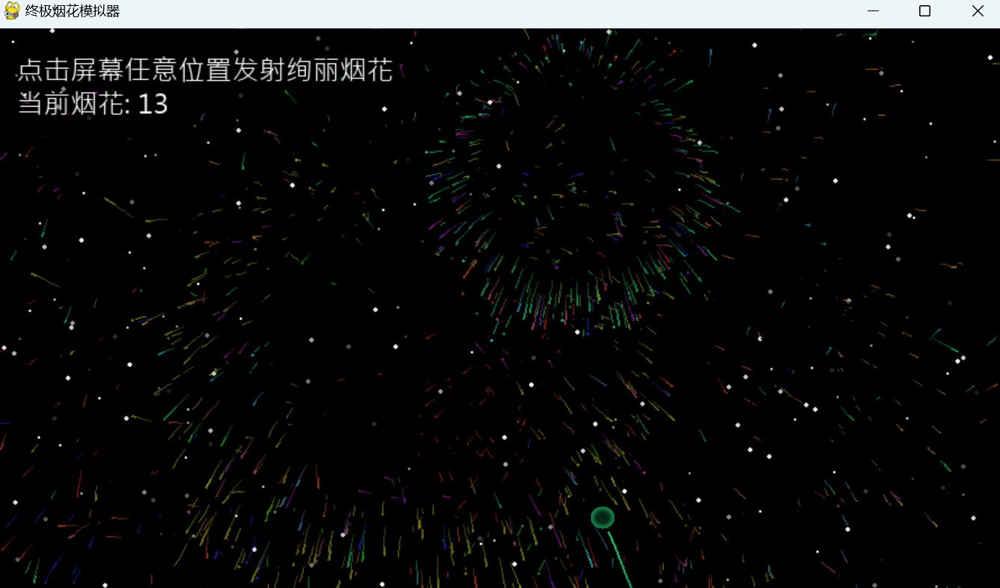
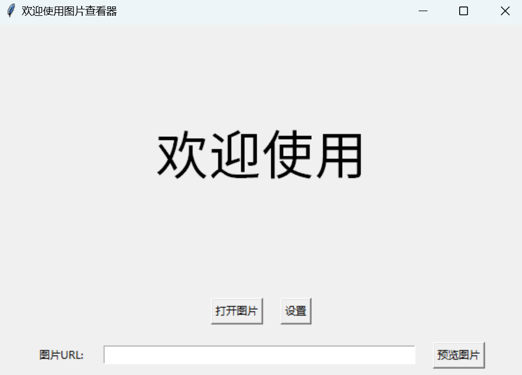
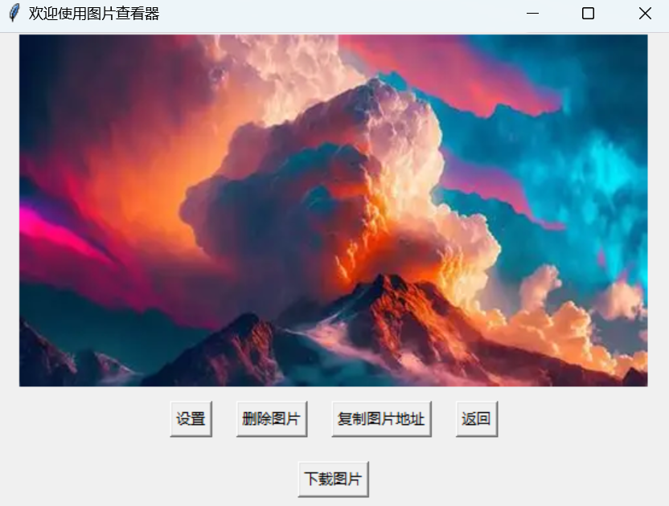
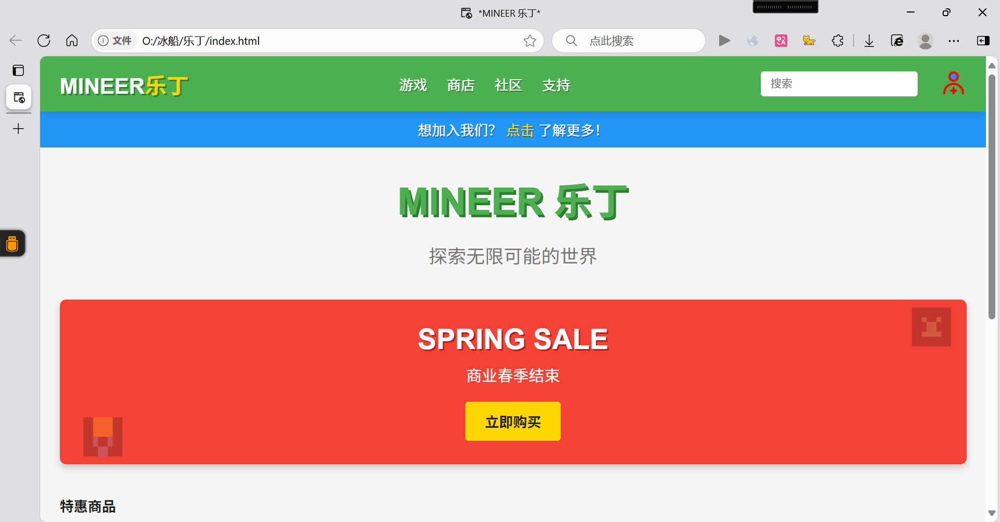
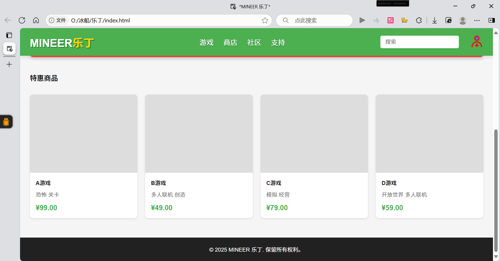

<!DOCTYPE html>
<html lang="zh-cn">
<head>
    <meta charset="UTF-8">
    <meta name="viewport" content="width=device-width, initial-scale=1.0">
    <title>欢迎 welcome</title>
    <!-- Favicon设置 -->
    <link rel="icon" href="favicon-32x32.ico" type="image/x-icon">
    <link rel="shortcut icon" href="favicon-32x32.ico" type="image/x-icon">
    <link rel="icon" type="image/png" href="favicon-32x32.png" sizes="32x32">
    <link rel="icon" type="image/png" href="favicon-16x16.png" sizes="16x16">
    <link rel="apple-touch-icon" href="apple-touch-icon.png">
    
    
</head>
<body>
    

        <h1>Hanfei---的项目作品集</h1>
        <ul>
            <li>
                <a href="https://www.123865.com/s/KiwrTd-rQ40v" target="_blank">烟花模拟器</a>
                
一个精美的烟花模拟器，可以自定义烟花效果和颜色，带来视觉盛宴。
 
                
⭐ 收藏 | 更新于 2025-06-20 | 提取码：0620

                

                    

                          
                    

                

            </li>
            <li>
                <a href="https://www.123865.com/s/KiwrTd-bm40v" target="_blank">图片查看器</a>
                
一个打包好了的exe程序，虽然不知道有啥用

                
⭐ 收藏 | 更新于 2025-06-29 | 提取码：9261

                

                    

                        
                        
                

            </li>
            <li>
                <a href="https://www.123865.com/s/KiwrTd-KQ40v提取码:2202" target="_blank">游戏商店网站模板</a>
                
响应式游戏商店网站模板，适合各类游戏展示和销售，包含完整的前端界面。

                
⭐ 收藏 | 更新于 2025-06-20 | 提取码：2202

                

                    

                        
                        
                    

                

            </li>
            <!-- 你可以继续手动添加更多项目 -->
        </ul>
    

    <!-- 图片放大查看的模态框 -->
    

        &times;
        <a class="prev" onclick="plusSlides(-1)">&#10094;</a>
        <a class="next" onclick="plusSlides(1)">&#10095;</a>
        
    

    
    <!-- 新增的页脚 -->
    <footer class="site-footer">
        

            

                
Oscar 版权所有

                
个人资源分享网站

                
联系方式: 209524484（QQ）

            

        

    </footer>

    
</body>
</body>

</html>
